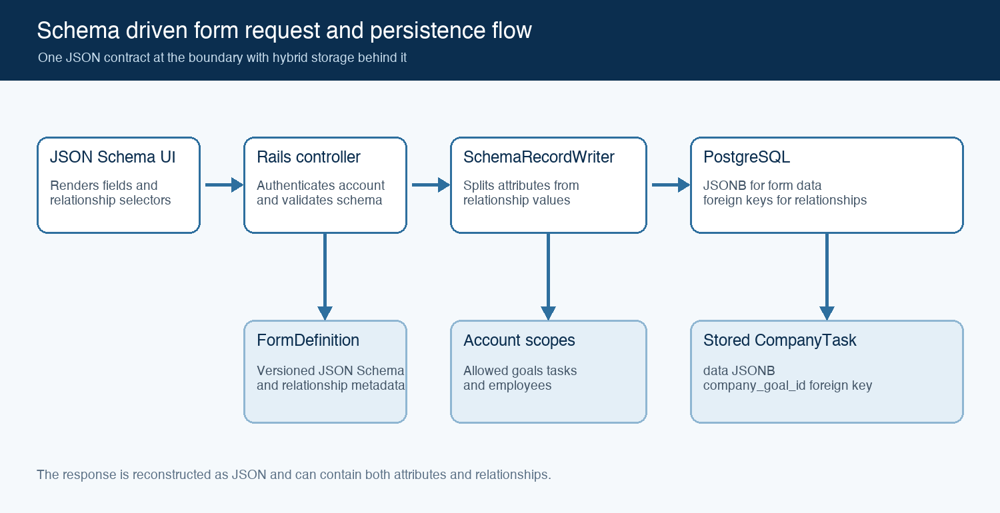

# Schema Driven Forms

*Rails, PostgreSQL, and MySQL Design Proposal*

| STATUS<br>Proposed | OWNER<br>To be confirmed | LAST UPDATED<br>15 September 2026 |
| --- | --- | --- |

| Authors | To be confirmed |
| --- | --- |
| Reviewers | Engineering and product reviewers to be confirmed |
| Related documents | JSON Schema definitions and API contract to be added during implementation |
| Scope | Schema driven forms for CompanyGoal, CompanyTask, IndividualEmployeeTask, and MySQL-backed Employee relationships |

## 1 Abstract

This proposal recommends a hybrid persistence model for schema driven forms. Each form definition is expressed as JSON Schema and can be stored in a versioned FormDefinition record. User defined, non-relational values are stored in a JSONB data column. Relationships use explicit structural columns and Rails association syntax. Employee remains a MySQL-backed model, so the `employee` association is a Rails-level convenience backed by `employee_id` rather than a PostgreSQL-enforced foreign key.

The frontend continues to render one form from JSON Schema. Relationship fields appear in that schema and in API requests and responses, but Rails removes their values from the JSONB payload before saving. This retains runtime field flexibility while keeping known relationships visible, indexed, and auditable. Same-database relationships can use the strongest available PostgreSQL protections; the MySQL-backed Employee association requires application validation, delete policy, and reconciliation.

## 2 Goals and Non Goals

| Goals | Non goals |
| --- | --- |
| Render CompanyGoal and task forms from JSON Schema | Allow arbitrary Rails model names from client input |
| Add or change non-relational fields without database migrations | Store a second authoritative copy of relationship IDs in JSONB |
| Enforce account ownership and relationship integrity on the server | Build a general document database or object graph engine |
| Return consistent field-level validation errors to the frontend | Define production scale targets before usage data is available |

## 3 Persistence Options

Three persistence strategies were considered. The hybrid option is selected because the form fields are dynamic while the business relationships are known in advance.

| Approach | Fields | Relationships | Assessment |
| --- | --- | --- | --- |
| Fully relational | Typed columns | Foreign keys and join tables | Strong integrity but every field change needs a migration |
| Hybrid selected | JSONB data | Explicit relationship columns, plus foreign keys where available | Dynamic fields with visible and indexed relationships |
| Fully document based | JSONB data | IDs inside JSONB | Maximum flexibility but application-owned integrity and query logic |

Storage and representation remain separate. The API may return a single JSON document containing attributes and relationships even though PostgreSQL stores those values in different places.

## 4 Proposed Architecture



Figure 1  Schema driven form request and persistence flow

#### Domain relationships

```
Account
  ├── has many CompanyGoals
  ├── has many CompanyTasks through CompanyGoals
  └── has many Employees in MySQL
CompanyGoal
  └── has many CompanyTasks
CompanyTask
  └── has many IndividualEmployeeTasks
IndividualEmployeeTask
  ├── belongs to CompanyTask
  └── belongs to Employee through employee_id
```

Each employee belongs to one account in MySQL. A company task inherits its account through its company goal in PostgreSQL. An individual employee task connects one company task to one employee through a Rails `employee` association backed by `employee_id`, then validates that employee against MySQL through the account scope. It also stores employee-specific form values in its own JSONB data document.

#### Database records

| Table | Structural columns | JSONB responsibility |
| --- | --- | --- |
| form_definitions | id, record_type, version, active | JSON Schema, relationship metadata, and optional UI metadata |
| company_goals | account_id, form_definition_id | All goal fields including title, status, dates, and priority |
| company_tasks | company_goal_id, form_definition_id | All company task fields |
| individual_employee_tasks | company_task_id, employee_id, form_definition_id | Employee-specific status, dates, notes, and other fields |
| employees in MySQL | id, account_id | Existing employee storage remains unchanged |

#### Core components

| Component | Responsibility | Failure behaviour |
| --- | --- | --- |
| FormDefinition | Stores the versioned schema used to render and validate a record | An invalid or inactive definition cannot be used |
| Frontend form renderer | Renders ordinary fields and custom relationship selectors | Shows validation or option-loading errors without saving |
| FormSubmissionValidator | Validates the complete request against JSON Schema | Returns field-level 422 errors |
| SchemaRecordWriter | Separates JSONB values from allowed relationships | Rejects missing or cross-account targets |
| Active Record and PostgreSQL | Apply model rules, transactions, local constraints, and indexes | Roll back the PostgreSQL write and return a controlled error |
| MySQL-backed association checks | Validate Employee through account-scoped MySQL queries | Reject missing, inactive, or cross-account employees before saving |

## 5 Frontend Schema Contract

The schema sent to the frontend describes every form input. Standard JSON Schema keywords define value shape and validation. The application-specific x-relationship annotation tells the form renderer to use a relationship selector. JSON Schema ref remains reserved for schema reuse and does not represent a database foreign key.

```json
{
  "$schema": "https://json-schema.org/draft/2020-12/schema",
  "type": "object",
  "properties": {
    "title": { "type": "string", "minLength": 1 },
    "status": {
      "type": "string",
      "enum": ["not_started", "in_progress", "completed"]
    },
    "due_date": { "type": "string", "format": "date" },
    "company_goal_id": {
      "type": "integer",
      "x-relationship": {
        "association": "company_goal",
        "target": "CompanyGoal",
        "cardinality": "one",
        "optionsUrl": "/company_goals/options"
      }
    }
  },
  "required": ["title", "status", "company_goal_id"],
  "additionalProperties": false
}
```

A separate UI schema may hold widget names and display options if the chosen frontend library supports that convention. The server remains responsible for the relationship allow-list and must not trust model or class names supplied by the browser.

## 6 Request Lifecycle

1. Rails authenticates the user and resolves current_account.
2. The controller selects the active FormDefinition for the requested record type. The client need not send form_definition_id when only one active definition applies.
3. The frontend submits one document containing ordinary fields and relationship IDs.
4. FormSubmissionValidator validates the full document against the selected JSON Schema.
5. SchemaRecordWriter reads its server-side relationship allow-list and removes recognised relationship fields from the submitted hash.
6. Each relationship ID is resolved through current_account, such as current_account.company_goals in PostgreSQL or current_account.employees in MySQL.
7. The remaining fields are assigned to record.data, and relationship objects are assigned through Rails association setters.
8. Model validations and PostgreSQL constraints run inside the PostgreSQL save transaction. MySQL existence and account checks are application-enforced and must run before persistence.
9. The serializer reconstructs one JSON response containing attributes and relationships.

#### Create request

```json
{
  "company_task": {
    "title": "Contact customers at risk",
    "status": "in_progress",
    "due_date": "2026-10-31",
    "company_goal_id": 10
  }
}
```

After the writer runs, company_goal_id is stored in its explicit relationship column. The title, status, and due date are stored in company_tasks.data. The new company task receives its own ID only after it is saved.

## 7 Schema Record Writer

The writer is a translation layer rather than a validator for every business rule. It knows which top-level inputs represent relationships, resolves those inputs within the current account, deletes them from the working hash, and assigns the remaining hash to JSONB.

```ruby
class SchemaRecordWriter
  RELATIONSHIPS = {
    "CompanyTask" => {
      "company_goal_id" => {
        association: :company_goal,
        scope: ->(account) { account.company_goals }
      }
    },
    "IndividualEmployeeTask" => {
      "company_task_id" => {
        association: :company_task,
        scope: ->(account) { account.company_tasks }
      },
      "employee_id" => {
        association: :employee,
        scope: ->(account) { account.employees }
      }
    }
  }.freeze
  def initialize(record, submitted_data, account:)
    @record = record
    @submitted_data = submitted_data.deep_stringify_keys
    @account = account
  end
  def assign
    relationship_mapping.each do |input_key, definition|
      next unless @submitted_data.key?(input_key)
      relationship_id = @submitted_data.delete(input_key)
      assign_relationship(input_key, relationship_id, definition)
    end
    @record.data = @submitted_data
    @record
  end
  private
  def assign_relationship(input_key, id, definition)
    if id.blank?
      @record.errors.add(input_key, "must be selected")
      return
    end
    relation = definition.fetch(:scope).call(@account)
    target = relation.find_by(id: id)
    unless target
      @record.errors.add(
        input_key,
        "is not available for this account"
      )
      return
    end
    association = definition.fetch(:association)
    @record.public_send("#{association}=", target)
  end
  def relationship_mapping
    RELATIONSHIPS.fetch(@record.class.name, {})
  end
end
```

The mapping is an explicit allow-list. It prevents a client from choosing an arbitrary Ruby class. All mapped relationships use the same association assignment syntax, including the MySQL-backed Employee association. The difference is in the guarantee: PostgreSQL-owned associations can have local database protections, while Employee must be protected by account-scoped Rails validation and operational policy.

## 8 Controller and Error Contract

The controller coordinates authentication, schema selection, submission validation, the writer, persistence, and serialization. In a larger codebase this orchestration can move into a dedicated use-case service, leaving the controller with the same sequence.

```ruby
class CompanyTasksController < ApplicationController
  def edit
    task = current_account.company_tasks.find(params[:id])

    render json: {
      schema: task.form_definition.schema,
      data: SchemaFormSerializer.new(task).as_json
    }
  end

  def create
    definition = FormDefinition.find_by!(
      record_type: "CompanyTask",
      active: true
    )
    submission = params.require(:company_task).to_unsafe_h
    schema_errors = FormSubmissionValidator.new(
      definition,
      submission
    ).errors
    return render_errors(schema_errors) if schema_errors.any?
    task = CompanyTask.new(form_definition: definition)
    SchemaRecordWriter.new(
      task,
      submission,
      account: current_account
    ).assign
    return render_record_errors(task) if task.errors.any?
    if task.save
      render json: CompanyTaskSerializer.new(task).serializable_hash,
             status: :created
    else
      render_record_errors(task)
    end
  end

  private

  def render_errors(errors)
    render json: { errors: errors }, status: :unprocessable_entity
  end

  def render_record_errors(record)
    errors = record.errors.map do |error|
      {
        field: error.attribute.to_s,
        message: error.message
      }
    end

    render_errors(errors)
  end
end
```

The example uses to_unsafe_h because the submission is dynamic and is never passed into Active Record mass assignment. The selected JSON Schema must reject unexpected keys with additionalProperties set to false. A production implementation may instead derive a permitted parameter structure from the schema.

#### Form submission validator

The validator wraps the chosen JSON Schema library and normalises failures into the same field-level error shape used by model errors.

```ruby
class FormSubmissionValidator
  def initialize(form_definition, submitted_data)
    @form_definition = form_definition
    @submitted_data = submitted_data
  end

  def errors
    JSONSchemer
      .schema(@form_definition.schema)
      .validate(@submitted_data)
      .map { |error| normalize_error(error) }
  end

  private

  def normalize_error(error)
    {
      field: error.fetch("data_pointer").delete_prefix("/").tr("/", "."),
      message: error.fetch("type").to_s.humanize
    }
  end
end
```

The exact validator gem can vary. The important contract is that schema validation returns `[{ field:, message: }]` and runs before the writer assigns relational values.

#### Reconstructing the form shape

The serializer performs the reverse operation from the writer. It starts with the JSONB data document and adds relationship IDs back from columns or association foreign keys so the frontend receives a complete form payload for editing.

```ruby
class SchemaFormSerializer
  def initialize(record)
    @record = record
  end

  def as_json
    (@record.data || {}).deep_dup.tap do |data|
      relationship_mapping.each do |input_key, definition|
        association = definition.fetch(:association)
        data[input_key] = @record.public_send("#{association}_id")
      end
    end
  end

  private

  def relationship_mapping
    SchemaRecordWriter::RELATIONSHIPS.fetch(@record.class.name, {})
  end
end
```

For a company task stored as:

```ruby
company_task.company_goal_id = 10
company_task.data = {
  "title" => "Contact customers at risk",
  "status" => "in_progress",
  "due_date" => "2026-10-31"
}
```

the edit response becomes:

```json
{
  "schema": {
    "...": "..."
  },
  "data": {
    "title": "Contact customers at risk",
    "status": "in_progress",
    "due_date": "2026-10-31",
    "company_goal_id": 10
  }
}
```

The frontend does not need to know that `company_goal_id` is stored outside JSONB. The API boundary reconstructs the full form-shaped document.

#### API serializer

The record serializer can use the same form serializer so create, show, and edit responses stay consistent.

```ruby
class CompanyTaskSerializer
  def initialize(task)
    @task = task
  end

  def serializable_hash
    {
      id: @task.id,
      type: "CompanyTask",
      form_definition_id: @task.form_definition_id,
      data: SchemaFormSerializer.new(@task).as_json
    }
  end
end
```

#### Error response

```json
{
  "errors": [
    {
      "field": "company_goal_id",
      "message": "is not available for this account"
    }
  ]
}
```

Validation failures return HTTP 422. A cross-account ID receives the same response as a missing ID so the API does not reveal whether another account owns the record. Authentication failures remain 401 and authorisation failures unrelated to field selection remain 403.

## 9 Validation Responsibilities

| Layer | Checks | Purpose |
| --- | --- | --- |
| FormDefinition publication | Schema syntax, supported keywords, allowed relationship declarations | Prevents a broken schema from becoming active |
| Frontend | Required values, types, enum values, dates, and local display rules | Provides immediate feedback only |
| Backend JSON Schema | The complete submitted document including relationship ID shape | Treats the server as authoritative |
| SchemaRecordWriter | Relationship existence, account ownership, and assignment eligibility | Enforces tenant and relationship rules |
| Active Record | Required associations and cross-record business rules | Protects non-controller write paths |
| PostgreSQL | Not-null constraints, local indexes, local foreign keys where available, and transaction atomicity | Provides the final integrity boundary for PostgreSQL-owned data |
| MySQL-backed Employee checks | Employee existence, account ownership, active status, and deletion policy | Protects the cross-database association that PostgreSQL cannot enforce |

The JSON Schema format keyword may be annotation-only depending on validator configuration. Date and date-time formats must therefore be explicitly enabled in the chosen validator or checked by an application validator before persistence.

#### Cross account model validation

```ruby
class IndividualEmployeeTask < ApplicationRecord
  belongs_to :company_task
  belongs_to :employee,
    class_name: "Employee",
    foreign_key: :employee_id,
    primary_key: :id,
    optional: true
  belongs_to :form_definition

  validates :employee_id, presence: true
  validate :employee_and_task_share_account

  private

  def employee_and_task_share_account
    return if employee_id.blank? || company_task.blank?

    task_account_id = company_task.company_goal.account_id
    return if Employee.where(
      id: employee_id,
      account_id: task_account_id
    ).exists?
    errors.add(:employee_id, "is not available for this account")
  end
end
```

## 10 Account Scoping and Security

The account scope applies twice. The options endpoint limits what the frontend displays, and the writer applies the same restriction again when saving. The second check is required because a caller can bypass the frontend or alter the submitted ID.

```ruby
def options
  goals = current_account.company_goals
    .where("data->>'status' = ?", "active")
    .order(Arel.sql("data->>'title' ASC"))
  render json: goals.map { |goal|
    { id: goal.id, label: goal.data["title"] }
  }
end
```

- Resolve goals with current_account.company_goals rather than CompanyGoal.find.
- Resolve employees with current_account.employees in MySQL rather than Employee.find.
- Resolve company tasks with current_account.company_tasks through company goals.
- Never call constantize on a model type supplied by the client.
- Authorise the chosen FormDefinition when definitions can vary by account.
- Avoid logging sensitive JSONB values unless the logging policy explicitly permits them.

#### MySQL-backed Employee association

Employee can use Rails association syntax, but it is still a cross-database association. PostgreSQL cannot enforce that `individual_employee_tasks.employee_id` exists in MySQL, cannot cascade deletes from MySQL, and cannot join directly to the employee table for reporting.

The application should therefore treat Employee as an association with weaker database guarantees:

- Validate employee existence and account ownership before saving.
- Index `individual_employee_tasks.employee_id` in PostgreSQL for local filtering.
- Avoid hard-deleting employees in MySQL while PostgreSQL records may reference them.
- Add a deletion guard, soft delete policy, or reconciliation job for stale employee IDs.
- Keep Employee references out of JSONB unless the relationship itself truly needs to become user-configurable.

## 11 Consistency Querying and Versioning

#### Create and update behaviour

A complete form submission replaces record.data. A partial update must merge submitted non-relational values into the existing document or validate a reconstructed complete document. The API should distinguish PUT-style replacement from PATCH-style merge rather than relying on implicit behaviour.

The JSONB data and PostgreSQL relationship assignments should be saved in one PostgreSQL transaction. A local constraint or model-validation failure then leaves neither part partially updated. MySQL-backed Employee association checks are not protected by a PostgreSQL foreign key, so the application must validate them before save and periodically reconcile them after MySQL employee changes.

#### Filtering and indexes

Raw JSONB SQL should not be scattered through controllers, serializers, jobs, or report code. JSONB filtering should live behind a small allow-listed query layer, with domain scopes on the model and query objects for larger screens or reports.

The intended calling code should look like ordinary Rails:

```ruby
CompanyTask.in_progress
CompanyTask.due_before(Date.current)
CompanyTaskQuery.new(current_account.company_tasks)
  .for_dashboard
  .due_before(Date.current)
```

The model declares which JSONB fields are queryable:

```ruby
class CompanyTask < ApplicationRecord
  include JsonbFilterable

  jsonb_field :status, type: :string
  jsonb_field :due_date, type: :date
  jsonb_field :priority, type: :string

  scope :in_progress, -> { where_jsonb(:status, "in_progress") }
  scope :due_before, ->(date) { where_jsonb_date_lte(:due_date, date) }
end
```

The shared concern owns the SQL fragments and only accepts allow-listed fields:

```ruby
module JsonbFilterable
  extend ActiveSupport::Concern

  class_methods do
    def jsonb_field(name, type:)
      jsonb_fields[name.to_sym] = type
    end

    def jsonb_fields
      @jsonb_fields ||= {}
    end

    def where_jsonb(field, value)
      ensure_jsonb_field!(field)
      key = connection.quote_string(field.to_s)
      where("data->>'#{key}' = ?", value)
    end

    def where_jsonb_date_lte(field, value)
      ensure_jsonb_field!(field, expected_type: :date)
      key = connection.quote_string(field.to_s)
      where("(data->>'#{key}')::date <= ?", value)
    end

    private

    def ensure_jsonb_field!(field, expected_type: nil)
      type = jsonb_fields[field.to_sym]
      raise ArgumentError, "Unknown JSONB field: #{field}" unless type
      raise ArgumentError, "Expected #{expected_type}, got #{type}" if expected_type && type != expected_type
    end
  end
end
```

Screen-specific combinations should live in query objects rather than controllers:

```ruby
class CompanyTaskQuery
  def initialize(scope = CompanyTask.all)
    @scope = scope
  end

  def for_dashboard
    self.class.new(@scope.in_progress)
  end

  def due_before(date)
    self.class.new(@scope.due_before(date))
  end

  def relation
    @scope
  end
end
```

Indexes should match the allow-listed fields that are used frequently in filters or sorts:

```ruby
add_index :company_tasks,
  "(data->>'status')",
  name: "index_company_tasks_on_json_status"

add_index :company_tasks,
  "((data->>'due_date')::date)",
  name: "index_company_tasks_on_json_due_date"
```

Expression indexes should be created only for fields that are used frequently in filters or sorts. Date casts require schema validation to prevent malformed date values from breaking queries or index creation.

The codebase should have one rule: raw `data->>` SQL belongs only in `JsonbFilterable`, model scopes, query objects, or migrations. Application workflows should call named scopes and query objects rather than building JSONB SQL directly.

#### Schema versions

A saved record should retain its form_definition_id when the exact schema version matters for future display, validation, audit, or migration. Publishing a new definition creates a new version rather than mutating the contract for existing records. If there is one fixed schema per Rails model, the schema may instead live in source control and the client does not need to send form_definition_id.

## 12 Alternatives Considered

| Alternative | Reason considered | Reason not selected |
| --- | --- | --- |
| All fields and relationships in columns | Native Rails behaviour and strongest SQL ergonomics | Conflicts with runtime-configurable fields and requires frequent migrations |
| All fields and relationship IDs in JSONB | One self-contained document and no relationship migrations | Hides important references inside JSONB, makes reverse queries harder, and requires custom integrity logic |
| Duplicate relationship IDs in columns and JSONB | Raw JSONB appears self-contained | Creates two sources of truth and permanent synchronisation risk |
| Generic polymorphic relationship table | Supports administrator-defined relationships | Adds complexity that is unnecessary while relationship types remain known |

## 13 Open Questions

- Will each record retain the exact FormDefinition version used at creation, or always render with the latest active version?
- Will forms contain nested objects or arrays that require recursively generated permitted parameters?
- Which frontend JSON Schema library is in use, and should relationship controls use custom schema keywords or a separate UI schema?
- What makes an employee assignable beyond belonging to the account?
- Which JSONB fields require production indexes based on expected reports and filters?

## 14 Decision and Next Steps

Proceed with the hybrid design. Store non-relational form values in JSONB, store known relationships as explicit structural columns, describe relationship controls in the frontend schema, and reconstruct a unified JSON document at the API boundary. Use Rails association syntax for both PostgreSQL-owned relationships and the MySQL-backed Employee relationship. Use PostgreSQL constraints for PostgreSQL-owned relationships where available, and treat Employee as a cross-database association that requires application validation, deletion policy, and reconciliation.

| Milestone | Deliverable | Exit criteria |
| --- | --- | --- |
| M1 | Models, migrations, account associations, external Employee reference handling, and one CompanyTask schema | A task saves JSONB fields and an account-scoped goal relationship |
| M2 | FormSubmissionValidator, SchemaRecordWriter, controllers, and error contract | Automated tests cover valid, invalid, missing, cross-account, and stale Employee references |
| M3 | Frontend relationship widget and scoped options endpoints | The form renders, submits, and displays field-level errors end to end |
| M4 | Index review, schema version policy, audit logging, and rollout | Query plans are acceptable and schema changes are recoverable |
