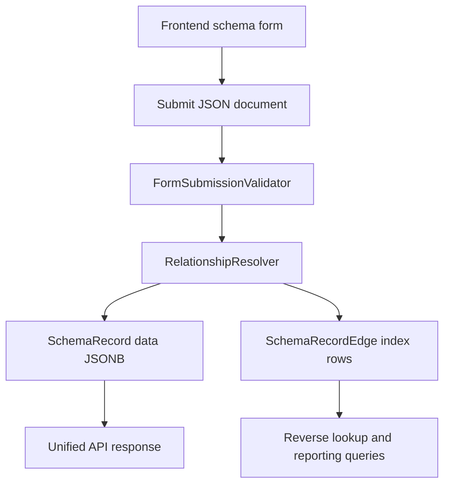

# Flexible JSON Relationships

*Alternative Rails and PostgreSQL design proposal*

| STATUS | OWNER | LAST UPDATED |
| --- | --- | --- |
| Exploratory | To be confirmed | 15 September 2026 |

| Area | Detail |
| --- | --- |
| Scope | Store form values and model relationships inside JSONB for maximum runtime flexibility |
| Primary alternative to | Hybrid model with JSONB fields and relational foreign keys |
| Recommended variant | JSON relationships as source of truth, with a derived edge table for querying and integrity checks |

## 1 Abstract

This proposal describes an alternative schema driven forms architecture where relationships are stored inside the submitted JSON document rather than as model-specific Rails associations and PostgreSQL foreign keys.

Instead of a `CompanyTask` table having a `company_goal_id` column, the task record stores a schema-defined relationship reference inside its JSONB `data` document. The backend validates those references against the active `FormDefinition`, resolves them through the current account, and optionally writes derived relationship edges into a generic index table.

The design maximises flexibility. New relationship fields, new record types, and new relationship cardinalities can be introduced through schema changes rather than database migrations. The trade-off is that the application must take over responsibilities normally handled by Active Record and PostgreSQL foreign keys.

## 2 Goals and Non Goals

| Goals | Non goals |
| --- | --- |
| Allow relationship fields to be added or changed without migrations | Preserve normal Rails `belongs_to` and `has_many` behaviour for every relationship |
| Support dynamic record types defined by schema | Allow arbitrary client supplied model names or table names |
| Keep form submission and storage shape closely aligned | Rely on JSONB alone for every production query |
| Validate account ownership and target existence on the server | Avoid all relational structure in PostgreSQL |
| Support reverse lookups through a generic edge index | Guarantee database-level foreign keys for JSON references |

## 3 Design Summary

The application stores each schema driven object as a generic record:

```text
SchemaRecord
  id
  account_id
  record_type
  form_definition_id
  data jsonb
```

Relationships live inside `data`:

```json
{
  "title": "Contact customers at risk",
  "status": "in_progress",
  "due_date": "2026-10-31",
  "relationships": {
    "company_goal": {
      "target_type": "CompanyGoal",
      "target_id": 10
    },
    "assignees": [
      {
        "target_type": "Employee",
        "target_id": 42
      },
      {
        "target_type": "Employee",
        "target_id": 57
      }
    ]
  }
}
```

A derived edge table is rebuilt whenever a record is saved:

```text
SchemaRecordEdge
  account_id
  source_record_id
  relationship_key
  target_record_type
  target_record_id
```

The JSON document remains the source of truth. The edge table exists to make reverse queries, delete checks, reporting, and integrity scans practical.

## 4 Proposed Architecture



### Core Tables

| Table | Structural columns | JSON responsibility |
| --- | --- | --- |
| `form_definitions` | `id`, `record_type`, `version`, `active`, `account_id` optional | JSON Schema, relationship declarations, UI metadata |
| `schema_records` | `id`, `account_id`, `record_type`, `form_definition_id` | All form values and relationship references |
| `schema_record_edges` | `account_id`, `source_record_id`, `relationship_key`, `target_record_type`, `target_record_id` | Derived index of JSON relationships |
| `employees` | Existing employee columns | Can remain a normal relational table if employees are not schema records |

### Record Type Options

There are two viable versions of the model.

| Option | Description | Best when |
| --- | --- | --- |
| Generic records only | `CompanyGoal`, `CompanyTask`, and similar concepts are all rows in `schema_records` | Record types are product configurable |
| Mixed target model | Dynamic form records use `schema_records`, but stable targets such as `Employee` remain normal Rails models | Some domain objects are stable and operationally important |

The mixed target model is often the safer first implementation. It keeps employees, accounts, and authentication related objects conventional while allowing goals and tasks to become dynamic schema records.

## 5 Frontend Schema Contract

Relationship fields are ordinary schema properties with an application-specific annotation. The annotation is controlled by the server-side `FormDefinition`, not by arbitrary client input.

```json
{
  "$schema": "https://json-schema.org/draft/2020-12/schema",
  "type": "object",
  "properties": {
    "title": {
      "type": "string",
      "minLength": 1
    },
    "status": {
      "type": "string",
      "enum": ["not_started", "in_progress", "completed"]
    },
    "relationships": {
      "type": "object",
      "properties": {
        "company_goal": {
          "type": "object",
          "x-relationship": {
            "target": "CompanyGoal",
            "cardinality": "one",
            "optionsUrl": "/schema_records/options?record_type=CompanyGoal"
          }
        },
        "assignees": {
          "type": "array",
          "x-relationship": {
            "target": "Employee",
            "cardinality": "many",
            "optionsUrl": "/employees/options"
          }
        }
      },
      "required": ["company_goal"]
    }
  },
  "required": ["title", "status", "relationships"],
  "additionalProperties": false
}
```

The submitted payload should use a predictable relationship reference shape:

```json
{
  "schema_record": {
    "record_type": "CompanyTask",
    "data": {
      "title": "Contact customers at risk",
      "status": "in_progress",
      "relationships": {
        "company_goal": {
          "target_id": 10
        },
        "assignees": [
          {
            "target_id": 42
          }
        ]
      }
    }
  }
}
```

The server already knows the allowed target type for `company_goal` and `assignees` from the active schema. The client does not need to send Ruby class names.

## 6 Request Lifecycle

1. Rails authenticates the user and resolves `current_account`.
2. The controller selects the active `FormDefinition` for the requested `record_type`.
3. The frontend submits one JSON document containing ordinary values and relationship references.
4. `FormSubmissionValidator` validates the complete document against JSON Schema.
5. `RelationshipResolver` reads the server-side relationship declarations from the form definition.
6. Each relationship reference is resolved through the current account.
7. The full document is saved to `schema_records.data`.
8. Existing edge rows for the record are deleted and rebuilt from the submitted relationships.
9. The record and its edges are saved in one database transaction.
10. The serializer returns a unified JSON document.

## 7 Relationship Resolver

The resolver validates relationship references without converting them into model-specific associations.

```ruby
class RelationshipResolver
  def initialize(form_definition, data, account:)
    @form_definition = form_definition
    @data = data.deep_stringify_keys
    @account = account
    @errors = []
    @edges = []
  end

  attr_reader :errors, :edges

  def resolve
    relationship_definitions.each do |key, definition|
      value = relationships.fetch(key, nil)

      if definition.required? && value.blank?
        @errors << field_error(key, "must be selected")
        next
      end

      Array.wrap(value).each do |reference|
        resolve_reference(key, reference, definition)
      end
    end

    self
  end

  private

  def resolve_reference(key, reference, definition)
    target_id = reference["target_id"]
    target = scope_for(definition.target).find_by(id: target_id)

    unless target
      @errors << field_error(key, "is not available for this account")
      return
    end

    @edges << {
      relationship_key: key,
      target_record_type: definition.target,
      target_record_id: target.id
    }
  end

  def scope_for(target)
    case target
    when "CompanyGoal"
      @account.schema_records.where(record_type: "CompanyGoal")
    when "CompanyTask"
      @account.schema_records.where(record_type: "CompanyTask")
    when "Employee"
      @account.employees
    else
      raise UnsupportedRelationshipTarget, target
    end
  end

  def relationships
    @data.fetch("relationships", {})
  end
end
```

The important rule is that `scope_for` is an allow-list. The application must not call `constantize` on a value supplied by the browser.

## 8 Edge Index Maintenance

The write should happen in one transaction.

```ruby
SchemaRecord.transaction do
  record.update!(
    form_definition: definition,
    record_type: definition.record_type,
    data: submitted_data
  )

  record.schema_record_edges.delete_all

  resolver.edges.each do |edge|
    record.schema_record_edges.create!(
      account: current_account,
      relationship_key: edge.fetch(:relationship_key),
      target_record_type: edge.fetch(:target_record_type),
      target_record_id: edge.fetch(:target_record_id)
    )
  end
end
```

This makes the edge table a projection of the JSON document. If a save fails, both the JSON document and edge index roll back together.

## 9 Querying

### Forward Read

The record contains its own relationship references:

```ruby
record.data.dig("relationships", "company_goal", "target_id")
```

### Reverse Lookup

The edge table supports reverse queries:

```ruby
SchemaRecordEdge.where(
  account_id: current_account.id,
  target_record_type: "CompanyGoal",
  target_record_id: goal.id,
  relationship_key: "company_goal"
)
```

The source records can then be loaded:

```ruby
SchemaRecord.where(
  id: edges.select(:source_record_id),
  record_type: "CompanyTask"
)
```

### JSONB Field Filtering

Non-relationship fields can still use JSONB expression indexes:

```ruby
SchemaRecord.where(record_type: "CompanyTask")
  .where("data->>'status' = ?", "in_progress")
```

```ruby
add_index :schema_records,
  [:account_id, :record_type],
  name: "index_schema_records_on_account_and_type"

add_index :schema_records,
  "(data->>'status')",
  name: "index_schema_records_on_json_status"

add_index :schema_record_edges,
  [:account_id, :target_record_type, :target_record_id, :relationship_key],
  name: "index_schema_edges_on_target_lookup"
```

## 10 Validation Responsibilities

| Layer | Checks | Purpose |
| --- | --- | --- |
| FormDefinition publication | Valid schema syntax, supported field types, supported relationship declarations | Prevents invalid forms from becoming active |
| Frontend | Required fields, types, enums, local display rules | Provides immediate feedback |
| Backend JSON Schema | Complete submitted document shape | Treats the server as authoritative |
| RelationshipResolver | Target existence, account scope, cardinality, assignability | Protects tenant boundaries |
| SchemaRecord model | Required account, record type, definition, and data shape | Protects non-controller write paths |
| Edge table constraints | Required source, target descriptors, and lookup indexes | Keeps query projection consistent |

Because JSON references cannot use normal foreign keys, integrity is enforced by application code and supported by automated repair or audit jobs.

## 11 Delete and Orphan Behaviour

The system must define what happens when a referenced record is deleted.

| Policy | Behaviour | Trade-off |
| --- | --- | --- |
| Restrict delete | Prevent deletion while incoming edges exist | Safest and easiest to reason about |
| Nullify relationship | Remove references from source JSON documents | Flexible but requires JSON rewrites |
| Soft delete | Keep target records but hide them from normal views | Preserves history but adds filtering rules |
| Cascade delete | Delete dependent source records | Dangerous unless the dependency model is explicit |

For this design, restrict delete or soft delete are the safest defaults.

## 12 Security Rules

- Resolve all targets through `current_account`.
- Treat relationship target types as server-defined schema metadata.
- Do not trust client supplied class names, table names, or scopes.
- Return the same 422 response for missing and cross-account references.
- Authorise the active `FormDefinition`.
- Add tests for altered payloads that reference another account.
- Avoid logging full JSON documents when they may contain sensitive values.

## 13 Comparison With The Hybrid Model

| Dimension | Hybrid model | JSON relationship model |
| --- | --- | --- |
| Field flexibility | High for ordinary fields | High for ordinary fields and relationships |
| Relationship flexibility | Requires migrations for new foreign keys | New relationships can be schema-defined |
| Rails ergonomics | Strong | Weaker |
| Database integrity | Strong foreign keys | Application-enforced |
| Reverse queries | Straightforward associations | Requires edge table or JSONB queries |
| Reporting | Easier for known relationships | Requires planned indexes and projections |
| Product configurability | Moderate | High |
| Implementation risk | Lower | Higher |

## 14 Recommended Variant

If the product needs truly configurable relationships, use JSON relationships with a derived edge table.

Avoid a pure JSON-only approach unless the data will remain small and query requirements are minimal. Pure JSON-only storage feels simple at first, but reverse lookups, deletion checks, reporting, and account integrity become difficult as usage grows.

The edge table preserves the main benefit of the flexible model while giving the application an operationally useful relationship index.

## 15 Implementation Milestones

| Milestone | Deliverable | Exit criteria |
| --- | --- | --- |
| M1 | `schema_records`, `form_definitions`, and basic JSONB form save | A record saves and renders from schema |
| M2 | Relationship schema annotations and `RelationshipResolver` | Valid, missing, invalid, and cross-account references return correct errors |
| M3 | `schema_record_edges` projection | Reverse lookup queries work without scanning JSONB |
| M4 | Delete policy and integrity audit job | Referenced records cannot silently disappear |
| M5 | Index review and reporting queries | Expected filters and relationship lookups have acceptable query plans |

## 16 Open Questions

- Are `CompanyGoal`, `CompanyTask`, and `IndividualEmployeeTask` still meaningful Rails model classes, or should they become `record_type` values?
- Should `Employee` remain a normal relational model even if goals and tasks become schema records?
- Should relationship references store display labels as denormalised snapshots, or should labels always be resolved live?
- Which relationships need reverse lookup in the first release?
- What delete policy should apply to records that are already referenced?
- Do schema definitions vary per account, globally, or both?

## 17 Decision Point

Choose this design if relationship configurability is a core product requirement. Choose the hybrid design if the relationship model is mostly known in advance and the main flexibility need is adding ordinary form fields.

The strongest practical version is not pure JSON-only. It is JSON as the source of truth plus a generic edge table as a maintained projection.

## 18 Why Not Choose This By Default

This design should not be the default implementation if CompanyGoal, CompanyTask, IndividualEmployeeTask, and Employee are known product concepts with mostly stable relationships. The flexibility is real, but it is bought by moving relationship behaviour out of Rails and the database and into custom application infrastructure.

### It creates ORM-like responsibilities

Putting relationships inside JSON means the application must implement behaviour that Rails associations normally provide:

- Resolving relationship IDs into records.
- Enforcing account scoping for every relationship.
- Handling one-to-one, one-to-many, and many-to-many semantics.
- Implementing reverse lookups.
- Deciding restrict, nullify, soft delete, or cascade behaviour.
- Preventing or repairing orphaned references.
- Preloading linked records without N plus 1 queries.
- Auditing relationship changes.
- Keeping every controller, background job, import, and admin path consistent.

This is not just a persistence change. It is a custom relationship engine.

### Querying becomes harder as the product grows

Saving JSON is straightforward. Operating on it later is the difficult part.

Simple filters such as status or due date can be handled with JSONB expression indexes. More realistic product questions become more complex:

- Which tasks belong to this goal?
- Which tasks are assigned to this employee?
- Which records point to this record through any relationship?
- Can this goal, task, or employee be deleted safely?
- Show overdue tasks grouped by goal, account, assignee, and status.
- Report across several record types with different schemas.

Without an edge table, these become JSONB path queries, array searches, expression indexes, GIN indexes, or full scans. With an edge table, querying improves, but relationship data now exists both in JSON and in a derived projection.

### The edge table reduces one risk but introduces another

The edge table is useful because it makes reverse lookup and delete checks practical:

```text
source_schema_record_id | relationship_key | target_schema_record_id
25                      | company_goal     | 10
```

However, it also means the system stores relationship information twice:

```text
schema_records.data.relationships.company_goal.target_id = 10
schema_record_edges.target_schema_record_id = 10
```

The intended source of truth is still JSON, but the projection can drift unless the application:

- Rebuilds edges on every relationship write.
- Updates JSON and edges in the same transaction.
- Prevents direct edge edits.
- Tests that JSON and edges match.
- Provides an audit or repair job.
- Defines what to do if JSON and edges disagree.

That is a substantial consistency burden.

### Cross-database relationships are especially risky

If JSON records live in PostgreSQL and Employee lives in MySQL, the full JSON approach becomes a cross-database relationship system.

PostgreSQL cannot enforce that a JSON `employee_id` exists in MySQL. It also cannot cascade deletes from MySQL, join directly to MySQL for reporting, or protect a write with a single database transaction across both systems.

The hybrid model has the same cross-database limitation for Employee, but it keeps the relationship visible as an explicit `employee_id` column and can expose a Rails association. The all-JSON model hides the same external reference inside a flexible document, making it harder to query, audit, and debug.

### It weakens the value of Rails conventions

Rails associations give the team a shared vocabulary:

```ruby
company_task.company_goal
individual_employee_task.employee
company_goal.company_tasks
```

The all-JSON model replaces much of that with generic lookup code and schema interpretation. Future engineers need to understand both the schema system and the custom relationship engine before they can safely answer ordinary domain questions.

### It should require a high bar

Choose this design only if the product truly needs users or administrators to define new relationship types at runtime.

Do not choose it only to avoid migrations. If the relationship model is known in advance, explicit columns plus Rails association syntax are simpler, easier to query, easier to test, and easier to operate.

Recommended pushback:

- Dynamic form fields belong in JSONB.
- Known business relationships should remain explicit columns.
- MySQL-backed Employee can still use Rails association syntax, with app-level validation.
- JSON relationships should be reserved for relationship types that are genuinely user-configurable.
- If an edge table becomes necessary, acknowledge that the system is recreating relational structure as a custom projection.
